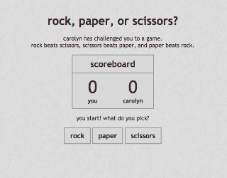

# Rock, Paper, or Scissors?

## Overview
* A game of Rock, Paper, or Scissors built using AngularJS. The player plays against the computer choosing rock, paper, or scissors. Rock beats Scissors, Scissors beats Paper, and Paper beats Rock. This game was built with AngularJS to access everything via the controller. The computer's play is calculated randomly using a JavaScript function and then the winner is determined based off of that and the player's play.

### Technologies, frameworks, & programming Languages used
* HTML5 & CSS3
* JavaScript
* AngularJS

### Url to live demo

[Check it out](http://danielrockpaperscissors-angular.surge.sh/)
